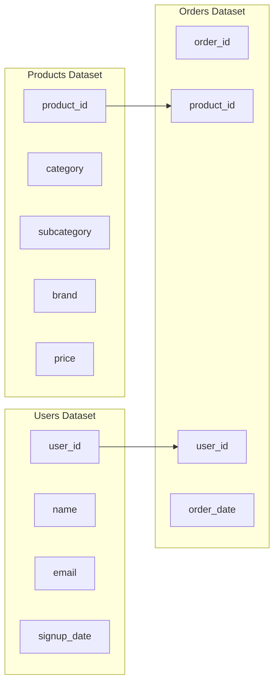

# Social-Commerce-Marketplace-Product-Analysis

## 1. Background and Overview
Our social commerce marketplace company launched a Bundle & Save feature. As a product data analyst, I was tasked with identifying how many users have used it, and how it has impacted **average order value** (**AOV**).
This task involved cleaning and analyzing orders made on our platform, followed by creating a Tableau dashboard to visualize performance trends. The final recommendation helps guide our strategy toward improving **AOV**.

## 2. Data Structure Overview
The datasets contain orders data from our e-commerce platform. In the orders dataset, each row represents an order placed by one user on a specific date. In the users dataset, each row represents key attributes of one user. In the products dataset, each row represents key attributes of a specific clothing item. The relationships between the tables is as follows:

## 3. Executive Summary
The key business question was:
How many users have used the Bundle & Save feature, and how has it impacted **average order value** (**AOV**). 

After cleaning and analyzing the data, I built Tableau dashboard that visualizes weekly **adoption rate** and **AOV** across both **buyer type** and **platform**, over time and in aggregate.

View the interactive dashboard [here.](https://public.tableau.com/app/profile/pablo.vega1512/viz/SocialCommerceMarketplaceProductAnalysis/Dashboard1#1)

## 4. Insights Deep Dive
Here are the most notable findings: **adoption rate** is **72.05%**, **AOV** is **$267.84**, **AOV** of **non-bundle orders** is **$267.81**, and **AOV** of **bundle orders** is **$267.91**.

### **Buyer Type** Performance

**New buyers** have the **highest adoption rate** at **72.32%**.

Other **buyer types'** **adoption rates** are as follows:

- **Returning buyers**: **71.93%**

- **Guest buyers**: **71.61%**

**Guest buyers** have the **highest AOV** at **$271.81**.

Other **buyer types'** **AOVs** are as follows:

- **New buyers**: **$268.17**

- **Returning buyers**: **$264.70**

### **Platform** Performance

Users who placed orders on the **web** have the **highest adoption rate** at **72.83%**.

Orders placed on the **app** have a **71.72 adoption rate**.

Users who placed orders on the **app** have the **highest AOV** at **$268.72**.

Orders placed on the **web** have a **$265.75 AOV**.

## 5. Recommendations
The Bundle & Save feature has been successful. In the time that it has been launched, **72.05%** of users have used it. But while most users have adopted the feature, its impact on **AOV** has been small. **AOV** of orders without the Bundle & Save feature is **$267.81**, and **AOV** of orders with the Bundle & Save feature is **$267.91**. If we want to increase **AOV**, my recommendation would be to work with the product team and adjust the Bundle & Save feature or create other tiers of discount options. For example, buy 3 items and save x amount, buy 4 items and save y amount, etc. These could increase order size and thus increase **AOV** over time.

